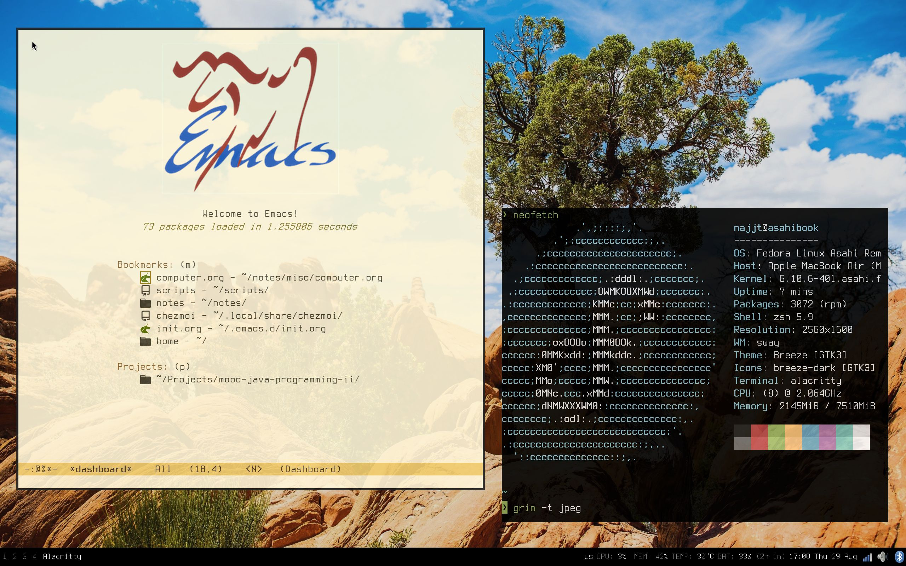

Welcome to my dotfiles repository! I use [chezmoi](https://www.chezmoi.io/) to manage them across macOS and Linux. It currently consists of the following components:

* **Shell**: zsh
* **Terminal**: Alacritty
* **Editor**: Emacs, see my [literate configuration](dot_emacs.d/init.org)
* **Browser**: qutebrowser
* **OS**: Fedora Asahi Remix/macOS
* **WM**: yabai/sway
* **Statusbar**: SketchyBar/waybar

